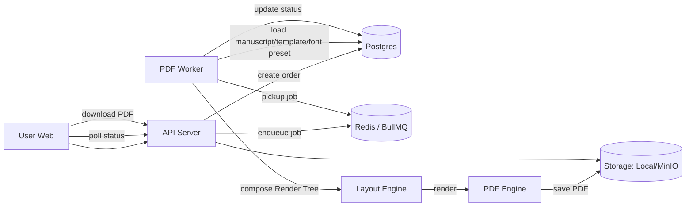
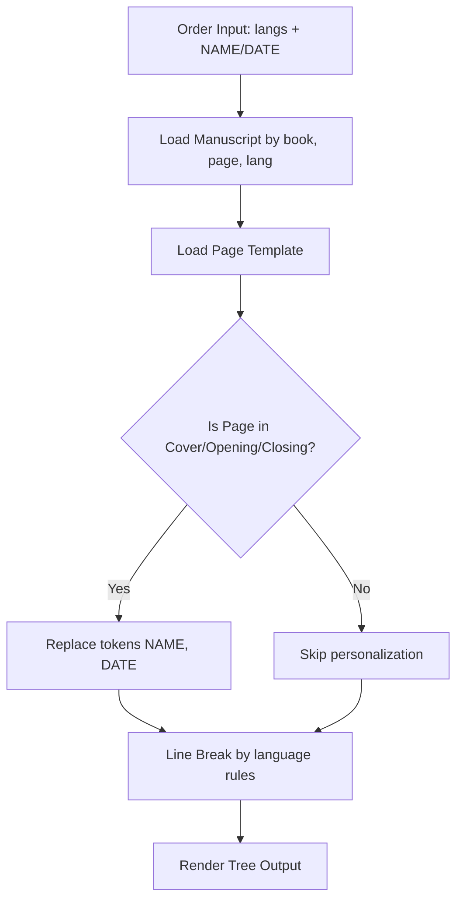
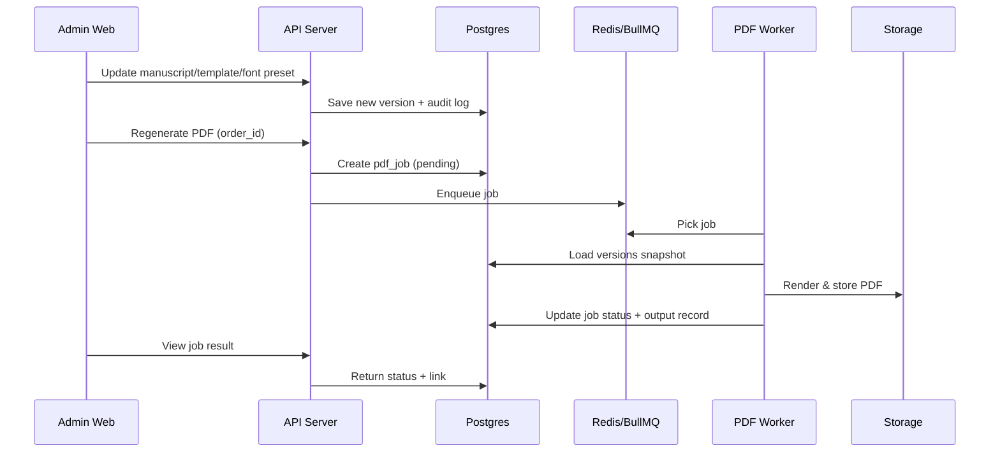

# 시스템 아키텍처/워크플로우 (v1.0)

## 1) 구성
- Web Client: 사용자 주문/생성 요청
- Web Admin: 원고/템플릿/폰트/주문 관리
- API Server: 인증/CRUD/주문/잡 생성, 파일 서빙
- PDF Worker: 조판(Render Tree) + PDF 렌더링 + 저장
- DB(Postgres), Queue(Redis/BullMQ), Storage(Local/MinIO)

---

## 2) 전체 플로우(주문 → PDF 생성)

---

## 3) 개인화 치환(3페이지 한정)

---

## 4) Admin 변경 → 재생성

