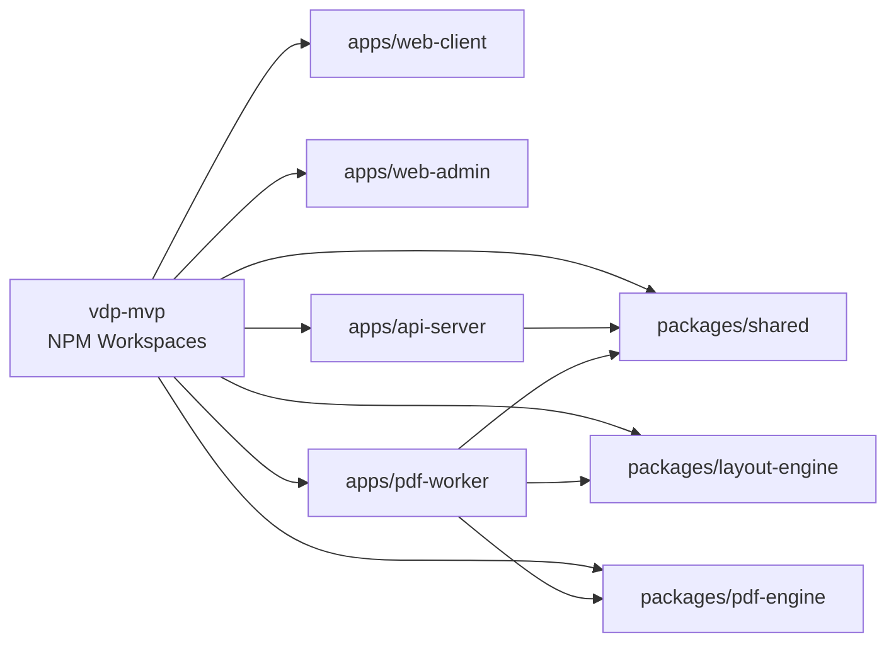
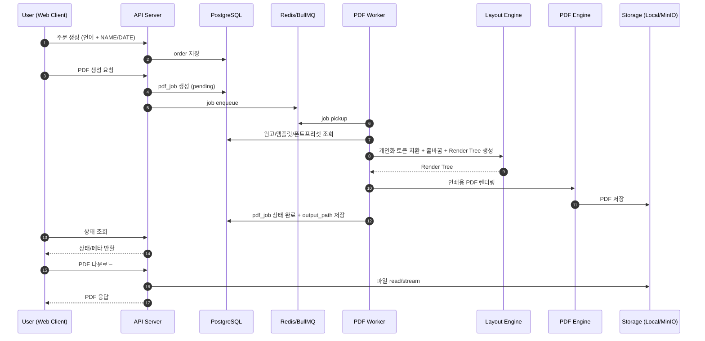
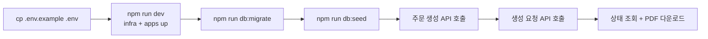

# 기술 스택 & 전체 워크플로우 (Mermaid)

본 문서는 이 레포의 **실제 구현 기준 기술 스택**과 **주문부터 PDF 다운로드까지의 End-to-End 워크플로우**를 머메이드 차트 중심으로 정리합니다.

## 1) 기술 스택 한눈에 보기

```mermaid
flowchart TB
  subgraph FE[Frontend]
    WC[web-client\nReact 18 + Vite 5]
    WA[web-admin\nReact 18 + Vite 5]
  end

  subgraph BE[Backend]
    API[api-server\nNode.js 18 + Express + pg + BullMQ]
    WK[pdf-worker\nNode.js 18 + pg + BullMQ]
  end

  subgraph PKG[Internal Packages]
    SH[@joya/shared\n공통 유틸/상수]
    LE[@joya/layout-engine\n라인브레이크/Render Tree]
    PE[@joya/pdf-engine\npdf-lib + fontkit]
  end

  subgraph DATA[Data & Infra]
    PG[(PostgreSQL)]
    RD[(Redis)]
    ST[(Storage\nLocal/MinIO)]
    DC[Docker Compose]
  end

  WC --> API
  WA --> API
  API --> PG
  API --> RD
  WK --> RD
  WK --> PG
  WK --> LE
  WK --> PE
  API --> SH
  WK --> SH
  PE --> ST
  DC -.orchestrates.-> FE
  DC -.orchestrates.-> BE
  DC -.orchestrates.-> DATA
```

## 2) 모노레포 구성 관점 의존 관계



## 3) 전체 워크플로우 (주문 → 생성 → 다운로드)



## 4) 운영 워크플로우 (로컬 개발/검증)



## 5) 핵심 포인트
- **웹/어드민 분리**: 사용자 주문 UX와 운영자 관리 UX를 분리.
- **API/Worker 분리**: 요청 처리와 무거운 PDF 생성 작업을 비동기로 분리.
- **패키지 분리**: 레이아웃 로직(layout-engine)과 PDF 렌더링(pdf-engine)을 독립 모듈화.
- **인프라 표준화**: Postgres/Redis/Storage를 Docker Compose로 로컬 재현 가능.
